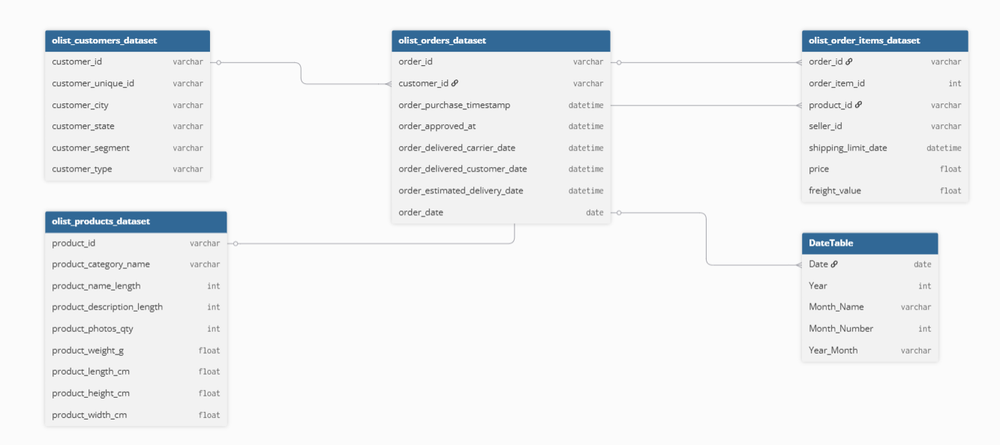
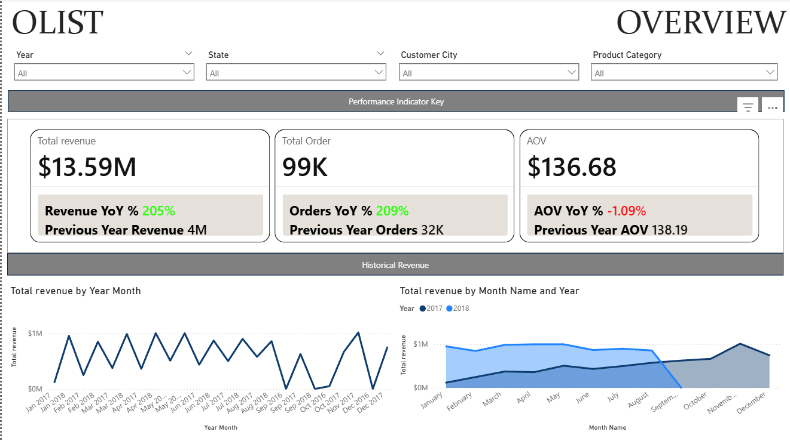
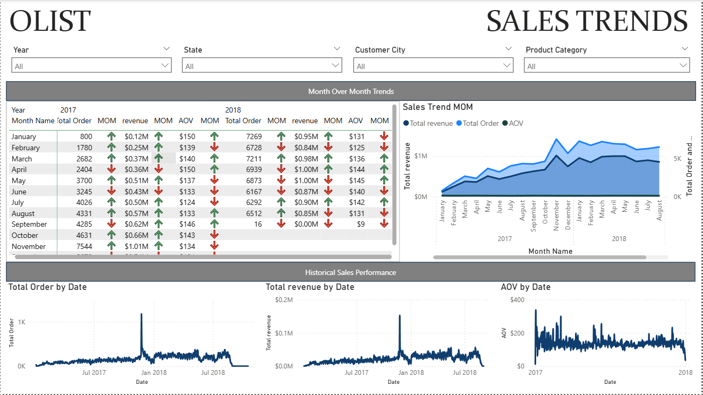
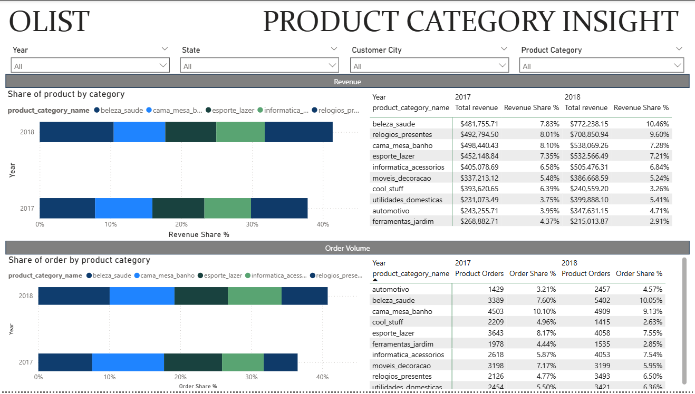
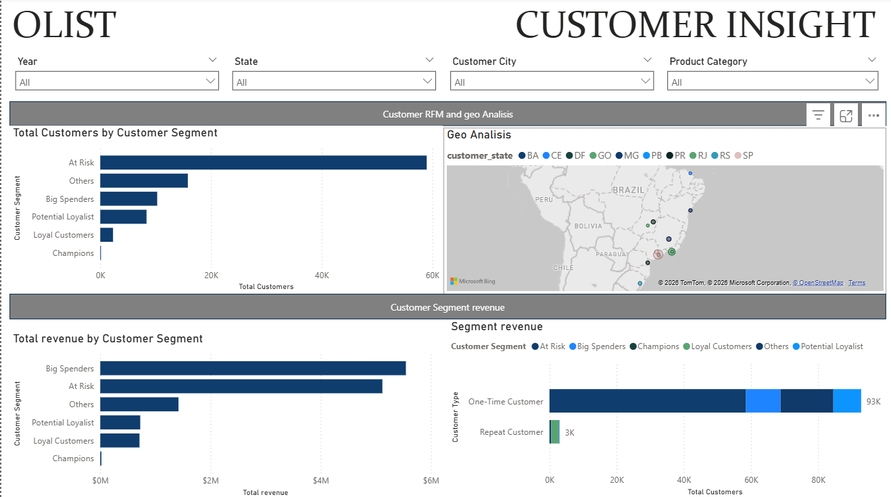

# Olist E-Commerce Sales & Customer Analytics

An end-to-end e-commerce analytics project using MySQL and Power BI to analyze sales performance, product category behavior, and customer retention opportunities.

---

# Project Background

This project analyzes the Brazilian E-Commerce Public Dataset published by Olist, a Brazilian technology company that provides e-commerce and marketplace solutions for small and medium-sized businesses.

The dataset contains real-world transactional data from orders placed between 2016 and 2018 across multiple Brazilian marketplaces. It includes information related to customers, orders, products, payments, delivery performance, and geographic locations.

The objective of this project is to transform raw transactional data into business insights using SQL and Power BI. The analysis focuses on identifying sales performance trends, product category behavior, customer purchasing patterns, and customer retention opportunities through interactive dashboards and analytical modeling.

The project simulates a real-world business intelligence workflow including:

* Data exploration and validation using SQL
* Relational data modeling
* KPI development
* Time-series analysis
* Customer segmentation using RFM analysis
* Interactive dashboard development in Power BI

The analysis is divided into four main business areas:

* Executive Overview
* Sales Trend Analysis
* Product Category Insight
* Customer Insight

Through this project, business questions related to revenue growth, customer behavior, repeat purchasing patterns, and product performance are explored to generate actionable business insights.

# Data Structure & Initial Checks

The project uses a relational e-commerce dataset consisting of multiple interconnected tables related to customers, orders, products, and transactional activities.

The data model was structured in Power BI using a star-schema-like approach to support analytical reporting and dashboard performance.

## Project Links

An interactive Power BI dashboard can be downloaded [here](dashboard/olist_dashboard.pbix).

The SQL queries used for Executive Overview analysis can be found [here](sql/executive_overview.sql).

The SQL queries used for Sales Trend Analysis can be found [here](sql/sales_trend_analysis.sql).

The SQL queries used for Product Category Insight can be found [here](sql/product_category_insight.sql).

The SQL queries used for Customer Insight and RFM segmentation can be found [here](sql/customer_insight.sql).

## Entity Relationship Diagram (ERD)

> 

---

## Initial Data Exploration

Before beginning the dashboard development process, several exploratory queries were performed using SQL to better understand the dataset structure and business context.

The exploration process focused on:

* Understanding table relationships
* Reviewing transaction structure
* Exploring revenue and order distributions
* Aggregating KPI metrics
* Comparing SQL calculations with Power BI results
* Identifying incomplete yearly data patterns

During the analysis process, several real-world analytical challenges were encountered, including:

* Incomplete transaction data for parts of 2016 and 2018
* Revenue discrepancies caused by filtering context
* Time-series sorting issues in Power BI
* Customer frequency imbalance in RFM analysis

These challenges helped strengthen the overall analytical process through repeated validation and sanity checking between SQL queries and Power BI calculations.

# Executive Summary

## Overview of Findings

> 

* The analysis of Olist’s e-commerce transactions between 2016 and 2018 reveals strong overall sales growth driven primarily by increasing order volume rather than higher transaction values. Total revenue reached approximately **$13.59M** across nearly **99K orders**, while Average Order Value (AOV) remained relatively stable at **$136.68**.

* Key performance indicators showed substantial year-over-year growth, with revenue increasing by **205%** and total orders rising by **209%**. However, AOV slightly declined by approximately **1%**, indicating that business expansion was largely fueled by customer purchasing frequency and transaction volume instead of increased basket size.

* The following sections further explore sales performance trends, product category behavior, and customer purchasing patterns to identify potential business opportunities and operational insights.

# Sales Trends

> 

* Sales performance showed strong growth from early 2017 through most of 2018. In January 2017, Olist recorded approximately **800 orders** and **$0.12M revenue**. By November 2017, monthly performance increased sharply to around **7,544 orders** and **$1.01M revenue**, making it one of the strongest months in the observed period.

* Throughout 2017, revenue increased from **$0.12M** in January to more than **$1.0M** in November, while order volume also grew significantly from **800 orders** to more than **7.5K orders**. This indicates that the company’s growth during 2017 was mainly driven by increasing transaction volume.

* In 2018, sales performance remained relatively strong during the first eight months. Monthly revenue stayed within the range of approximately **$0.84M** to **$1.00M**, while monthly order volume remained between roughly **6.1K** and **7.3K orders**. This suggests that after the rapid growth phase in 2017, Olist entered a more stable sales performance period in 2018.

* Average Order Value remained relatively stable across most months. In 2017, AOV generally ranged between **$124** and **$150**, while in 2018 it mostly stayed between **$125** and **$145**. This supports the conclusion that revenue growth was driven more by order volume expansion than by a significant increase in customer spending per order.

* One important limitation is visible in late 2018, where September shows only **16 orders** and nearly **$0.00M revenue**. This appears to be caused by incomplete transaction records in the dataset rather than an actual business collapse. Because of this, late-2018 data should be interpreted carefully.

Overall, the Sales Trends analysis shows that Olist experienced strong marketplace growth in 2017, followed by a more stable but still high-volume performance period in 2018. Revenue growth was primarily supported by increased order activity, while AOV remained comparatively stable.

## Product Performance

> 

* Product performance shows that Olist’s revenue and order volume were distributed across several key categories, with the top categories contributing around **30–40%** of total share in both 2017 and 2018. This indicates that Olist’s sales were not overly dependent on one single category, but supported by a relatively diversified product mix.

* In 2018, the strongest product categories generated meaningful revenue contribution. **beleza_saude** became the top revenue category, generating approximately **$772.2K** and contributing **10.46%** of total revenue. It was followed by **relogios_presentes** with around **$708.9K** and **9.60%** revenue share, and **cama_mesa_banho** with approximately **$538.1K** and **7.28%** revenue share.

* Order volume showed a similar pattern. The top categories also contributed around **30–40%** of total product orders, with **beleza_saude** contributing **10.05%** of orders in 2018 and **cama_mesa_banho** contributing **9.13%**.

Overall, the product analysis suggests that Olist’s sales performance was supported by multiple strong categories rather than one dominant product line. This creates a healthier product portfolio, while also highlighting opportunities to further optimize high-performing categories through targeted promotions, inventory planning, and cross-selling strategies.

# Customer Insight

> 

* Customer behavior analysis shows that Olist is heavily dominated by one-time customers, with approximately 93K customers making only one purchase, while repeat customers account for only around **3K customers**. This indicates that customer acquisition was strong, but repeat purchase behavior remained very limited.

* RFM segmentation further supports this finding. The largest customer segment is At Risk, with nearly **60K customers**, suggesting that a large portion of customers purchased in the past but have not returned recently. This highlights a major retention challenge for the platform.

* From a revenue perspective, Big Spenders generated the highest revenue contribution, reaching nearly **$6M**, despite not being the largest customer segment. This indicates that a smaller group of high-value customers contributed disproportionately to total sales.

* Geographic analysis also shows that revenue concentration is stronger in several major Brazilian states, especially around SP (São Paulo) and other high-activity regions. This suggests that customer demand is not evenly distributed geographically and that certain regions play a larger role in marketplace performance.

Overall, the customer analysis suggests that Olist’s main opportunity is not only acquiring new customers, but also improving retention among one-time and at-risk customers while maintaining stronger engagement with high-value customer segments.

# Recommendations

Based on the analysis conducted across sales performance, product categories, and customer behavior, several strategic recommendations can be identified to support sustainable business growth and improve customer retention.

---

## Short-Term Plan

### Improve Customer Retention

The analysis revealed that the marketplace is heavily dominated by one-time purchasers, while the “At Risk” segment represents the largest customer group. This indicates that customer acquisition is relatively strong, but repeat purchasing behavior remains limited.

In the short term, the company should focus on improving customer retention through targeted promotional strategies and personalized marketing campaigns aimed at re-engaging inactive customers.

Improving repeat purchase behavior could significantly increase long-term customer value while reducing dependency on continuous customer acquisition.

---

### Focus on High-Performing Product Categories

Several product categories consistently contributed strong revenue and order volume performance, particularly:

* beleza_saude
* cama_mesa_banho
* relogios_presentes
* esporte_lazer
* informatica_acessorios

The company should prioritize these categories through increased marketplace visibility, promotional campaigns, and product expansion strategies.

Strengthening already successful categories may generate faster short-term revenue growth while minimizing operational risk.

---

### Increase Average Order Value (AOV)

Although revenue and orders experienced strong growth, Average Order Value (AOV) remained relatively stable and slightly declined over time. This suggests that revenue growth is currently driven more by transaction volume than by increased customer spending per order.

Short-term strategies to improve AOV may include:

* product bundling,
* upselling recommendations,
* free shipping thresholds,
* and premium product positioning.

Increasing basket size could improve profitability without relying entirely on new customer growth.

---

## Long-Term Plan

### Develop Customer Loyalty & Segmentation Strategy

The RFM analysis demonstrates that customer purchasing behavior varies significantly across segments. While high-value customer groups such as “Big Spenders” contribute disproportionately high revenue, their population size remains relatively small.

In the long term, the company should develop more advanced customer retention and loyalty strategies focused on:

* personalized customer experiences,
* customer lifetime value optimization,
* targeted retention campaigns,
* and loyalty-based incentives.

A stronger loyalty ecosystem could improve long-term customer engagement and stabilize recurring revenue growth.

---

### Expand Geographic & Product Growth Opportunities

Revenue concentration is heavily centered around several major Brazilian states and cities, indicating opportunities for both geographic and product diversification.

Long-term growth opportunities may include:

* expanding marketplace penetration into underperforming regions,
* introducing higher-value products within strong-performing categories,
* and improving regional marketing optimization based on customer purchasing behavior.

Diversifying both geographic reach and product monetization may help reduce overreliance on specific customer groups or purchasing regions while supporting sustainable marketplace expansion.

